# Sistem Informasi Masjid Agung Gresik
> [!CAUTION]
> **Website ini bersifat non-komersial.**
> Dilarang keras untuk memperjualbelikan, mengomersialkan, atau mendistribusikan ulang aplikasi ini untuk tujuan keuntungan pribadi atau pihak lain tanpa izin tertulis dari pengembang dan pihak terkait.

| :---: |
| *Domain Public Website : https://masjidagunggresik.web.id/* |
| *Tutup pada 16 Juni 2026* |

Website ini berbasis Laravel dan berisi tampilan edukasi, manajemen reservasi sewa gedung, manajemen berita kegiatan, dana ZIS (Zakat, Infaq, Sedekah), pencatatan keuangan masjid. Selain tampilan website ini juga mengandung :
    - CRUD Berita
    - CRUD Transaksi
    - CRUD Reservasi
    
Harap ikuti langkah-langkah ini untuk menjalankan website!
## Cara Menjalankan
1. Clone repository ini
   ```bash
   git clone https://github.com/Firzakrn/Masjid-Agung-Gresik.git
   ```
2. Masuk ke direktori project
   ```bash
   cd Masjid-Agung-Gresik
   ```
3. Install dependencies
   ```bash
   composer install
   npm install
   ```

_Jika menggunakan Laragon (disarankan versi 8.0)_
Pindahkan/letakkan folder project ini ke dalam direktori:
```
Laragon > www > Masjid-Agung-Gresik
```

Project ini menggunakan fitur Gmail (SMTP) untuk pengiriman email, Midtrans sebagai payment gateway, dan Google Socialite untuk autentikasi. Sebelum menjalankan project, salin file `.env.example` menjadi `.env` (hapus akhiran `.example`). Dapat langsung copy file pada repository atau menggunakan command berikut pada terminal (pastikan sudah didalam direktori folder website),
   ```bash
   cp .env.example .env
   ```
lalu sesuaikan konfigurasi beriku sesuai kebutuhant:

- **Konfigurasi Gmail SMTP** — gunakan App Password Gmail (bukan password akun biasa). Tutorial lengkap: [Cara Mengaktifkan App Password Gmail untuk SMTP Laravel](https://digitalkit.id/blog/cara-konfigurasi-smtp-gmail-di-laravel/)
- **Konfigurasi Midtrans** — gunakan Server Key & Client Key dari dashboard Midtrans (mode Sandbox untuk development). Tutorial lengkap: [Penjelasan Lengkap Integrasi Midtrans dengan Laravel](https://dev.to/yogameleniawan/penjelasan-lengkap-tentang-fungsi-midtrans-payment-gateway-dan-integrasinya-dengan-laravel-1327)
- **Konfigurasi Google Socialite** — gunakan Client ID & Client Secret dari Google Cloud Console. Tutorial lengkap: [Tutorial Laravel Login dengan Google Socialite](https://youtu.be/1TvrgUdlzAc?si=x8PVrh6O9f_X3Y82)

Setelah `.env` dikonfigurasi, lanjutkan:

```bash
php artisan key:generate
php artisan migrate
```

## Cara Menyalakan Website pada Localhost 
_Localhost : komputer lokal sehingga website hanya bisa dibuka pada device yang menjalankan perintah berikut ini. Jika ingin membagikan localhost ikuti langkah-langkah [share](https://laragon.org/docs/quick-share)_
1. Jalankan Compiler Asset (Frontend):
   ```Bash
    npm run dev
   ```
    Biarkan terminal ini tetap terbuka.
2. Jalankan Server Laravel:
    Buka terminal baru (atau tab baru di terminalmu) dan ketik:
    ```Bash
    php artisan serve
    ```
_Jika menggunakan Laragon_
1. Klik Start All
2. Klik Menu
3. Pilih www
4. Pilih Nama Folder Web ini
---

## Tampilan Website
Website ini didominasi warna hijau tua atau #15803d sebagai identitas Masjid Agung Gresik serta berbagai warna komplemen lain untuk secara spesifik membedakan tipe pada berita dan kebutuhan kecil lainnya.

### Halaman User

**Home**
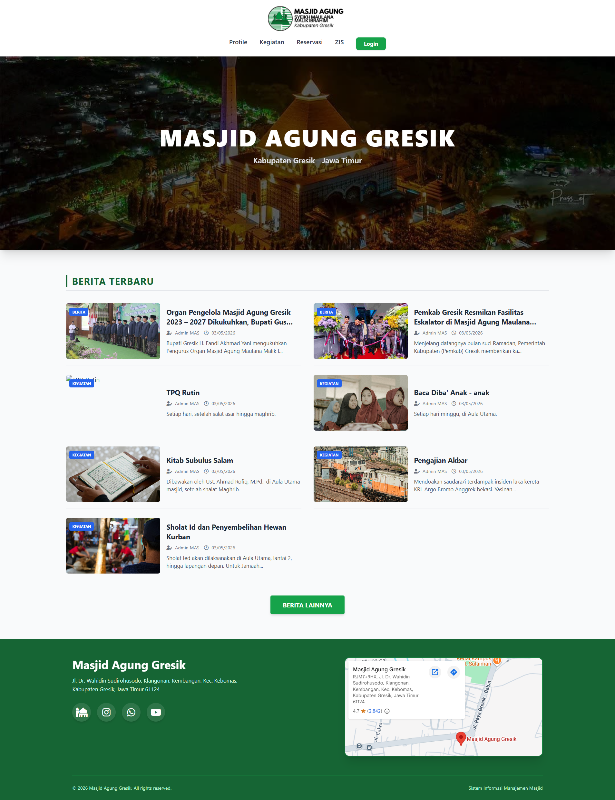 

**Reservasi**


**Berita**
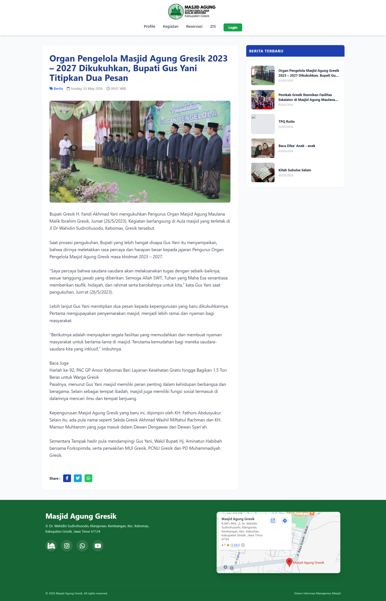

**Zakat**
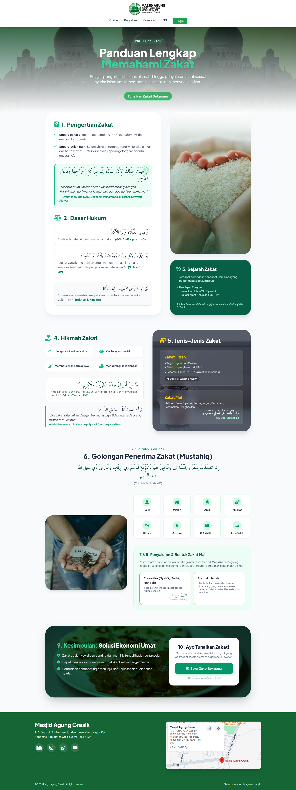

**Riwayat**
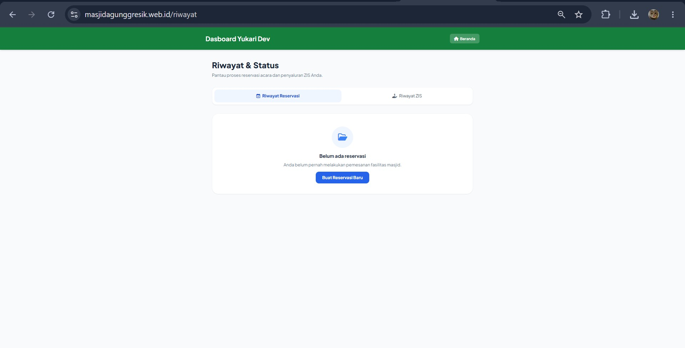 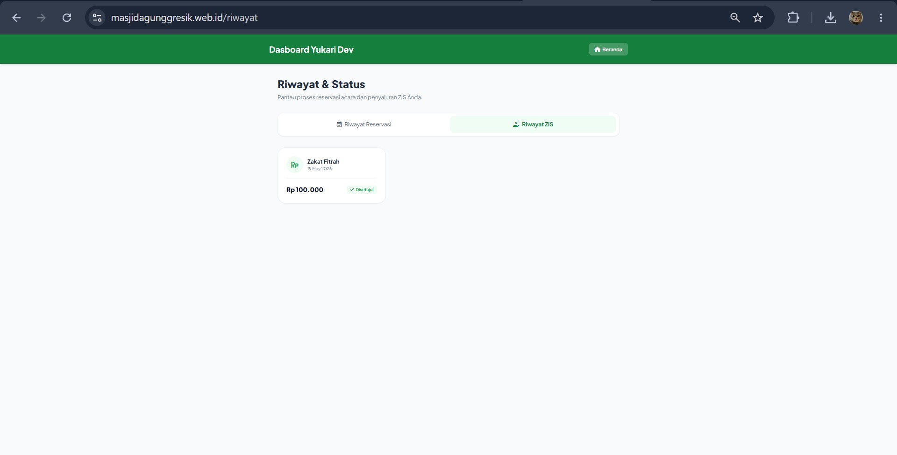

### Halaman Admin

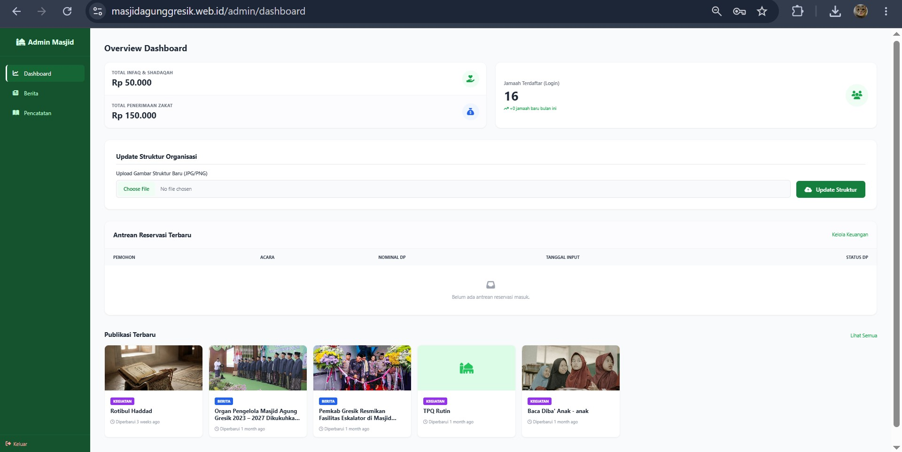

**Edit Berita**
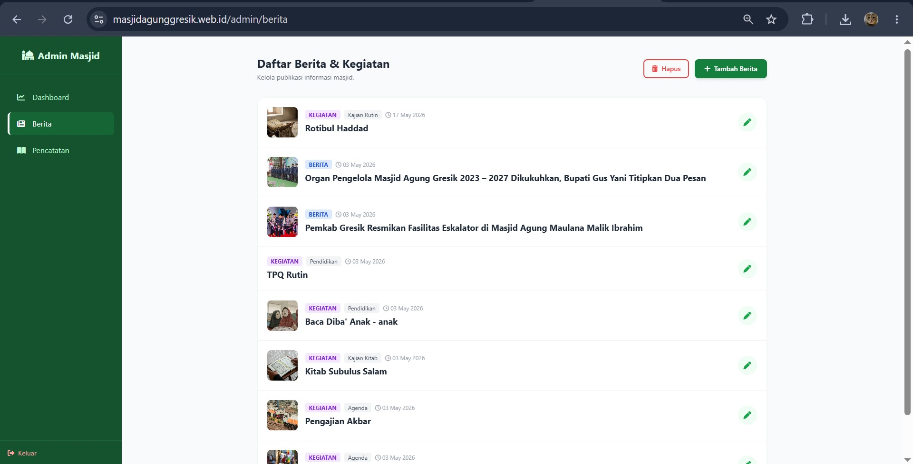

**Pencatatan**
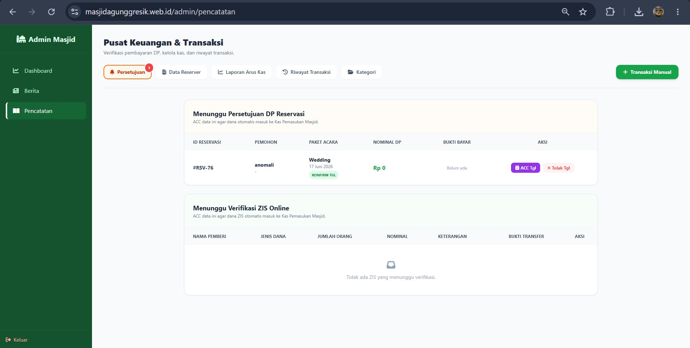
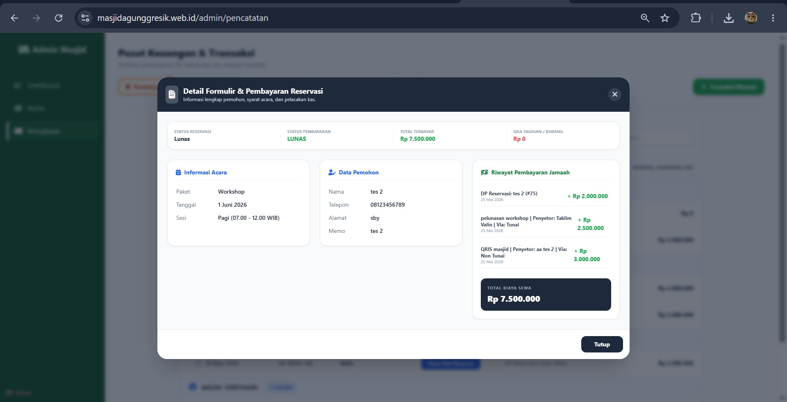
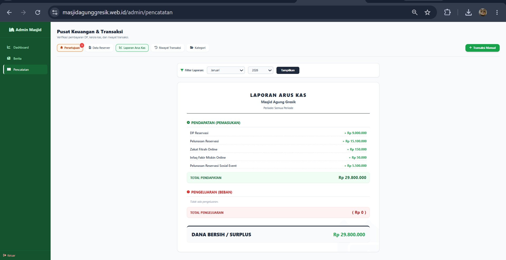
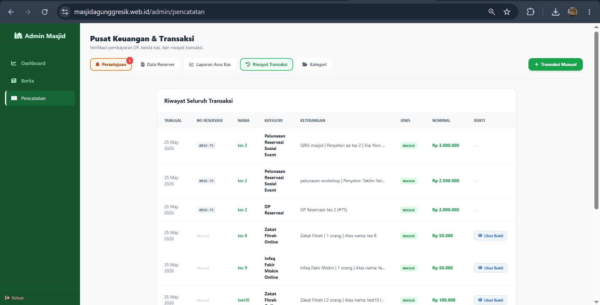
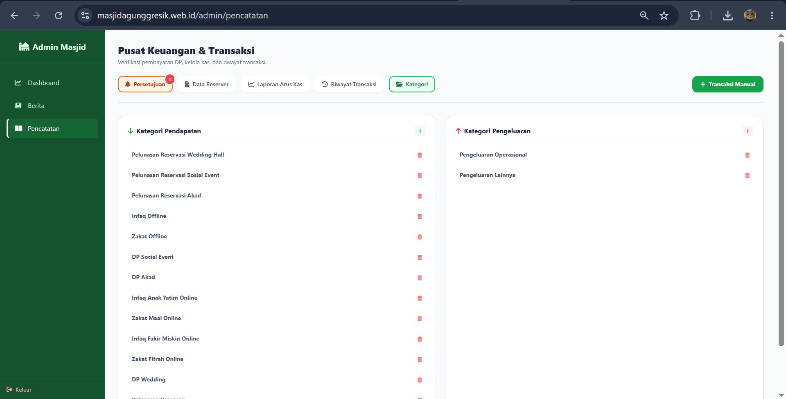
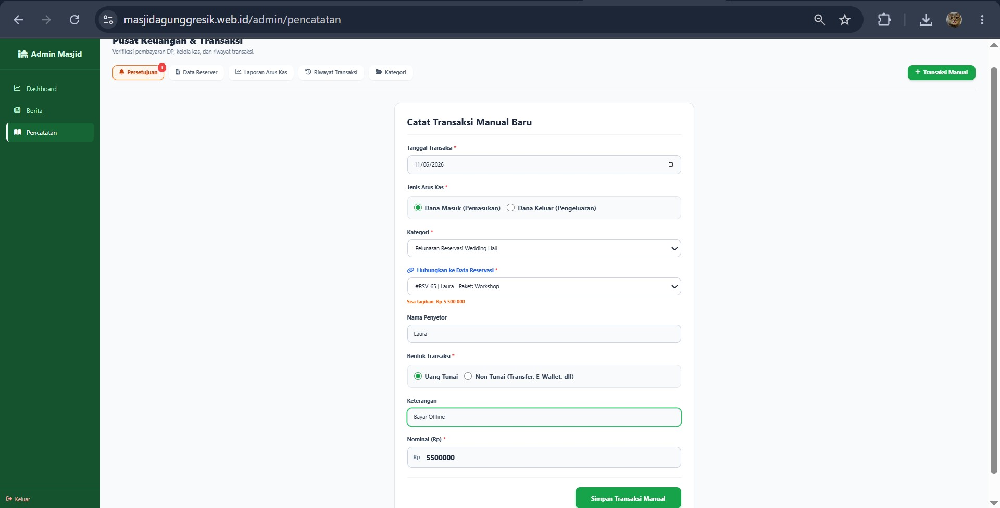

### Halaman Authentikasi
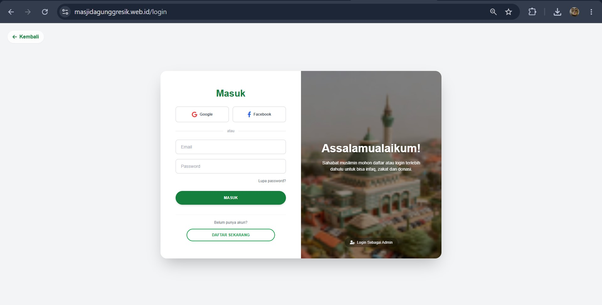
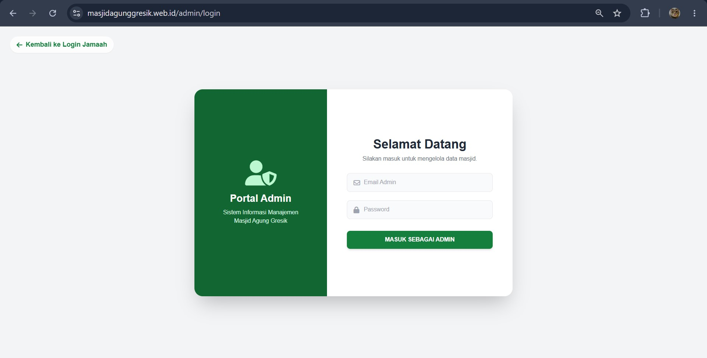

---
## Alur Sistem
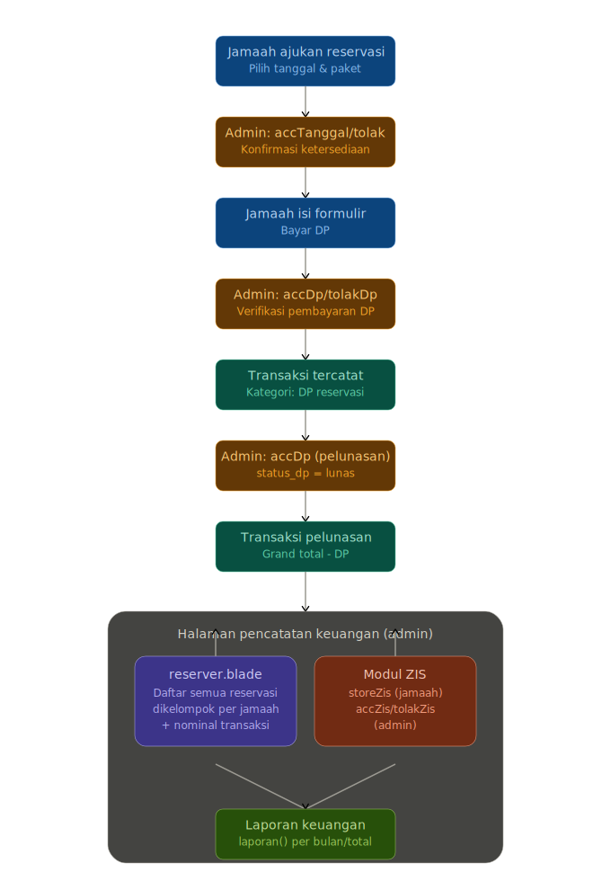

---
## Tech Stack
- **Backend**: Laravel (PHP), Node.js (Build Tools)
- **Frontend**: Blade, Tailwind CSS, Alpine.js, Font Awesome
- **Database**: MySQL
- **Email & Auth**: Gmail SMTP, Laravel Socialite
- **Payment Gateway**: Midtrans
- **Tools**: Laragon (phpMyAdmin for Database Management)

## Developers Team
[Kar's](https://github.com/Firzakrn) : Leader dan full-stack developer.
[Yuri](https://github.com/yuriaja) : Riset additional fitur dan backend developer
